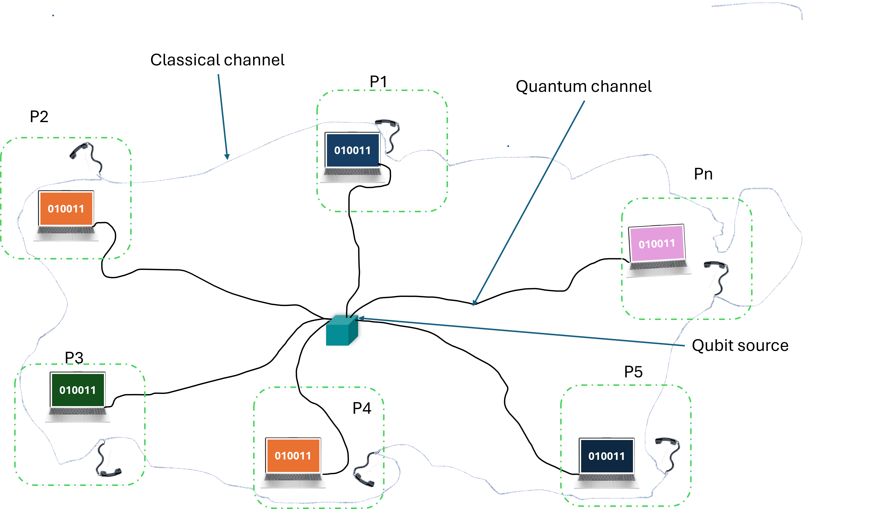

# Multi-Users Quantum Key Distribution Networks with IBM-Quantum Computer
This project showcases multi-users QKD networks on IBM-Quantum Computer (IBM-Boston). We demonstrate and implemente multi-parties QKD based on the famous E91 protocol. Up to our knowledge, this is the first ever time to implement multi-users entanglement based QKD on IBM-quantum computer simulating the real condition, with an infinite number of users, who are able to share entangled photonic qubits over unauthenticated quantum channels. It additionally implemente eavesdropper testing by demonstrating the violation of $N$-particles Svelitchny inequality. The example here considered showcases the working principle for 6 users, on ideal conditions (no eavesdropper) on one hand and assuming the worst scenario where the source is totally under eavesdropper's control who can perform the intercept-and-resend attack on the other hand. We then first  simulated the algorithm on ideal backend (Qiskit Aer Simulator) where only shot noise is considered, and on real backend (IBM-Boston), where qubits are totally noisy. The results  show sucessful distribution of secure key to all parties with a lenght of about 600 bits, a 0% quantum bit error rate (QBER) and the Svetlichny upper bound of 44.589, close to the theoretical value of $2^5\sqrt{2}$. This is obtained in ideal conditions (i.e. no eavesdropper and no extra noise appart from shot noise). However, the eavesdropper testing implementation clearly demonstrate the violation of Svetlichny inequality (the upper bound obtained is 0.335), exposing the eavesdropper to detection by legitimate users, and the QBER increased to more than 5% due to eavesdropper interference. 

The same simulation carried on the real quantum backend gave a smaller secrete key length (499 bits), a QBER of 7.75% and the Svelitchny upper bound of -1.638 when no eavesdropper interferred with the qubits but the latest are too noisy. However, when an eavesdropper interfers with those noisy qubits, we obtain a much more smaller secrete key length (499 bits), a QBER of 20.75% and the Svelitchny upper bound of -1.638. These results demonstrate that under a noisy environment, our multi-users QKD protocol might not be hundred per cent efficient since the QBER over pass the threshold value of 5% even when there is no eavesdropper in the middle. But with a performant error correction algorithm like the low density parity check (LDPC) for example, this can be improved. In addition, the learning information rate from eavesdropper is approximately 50% for all scenario, demonstrating that even though it might be hard, the eavesdropper can determine the secrete key with high accuracy, by performing additional post-processing techniques, if no action is taken from legitimate users (a privacy amplification for example). This algorithm demonstrate a practical example of QKD for example in internet communication or networks communication involving higher number of users.

**Working Principle**

The overall picture of the proposed scheme is as follows. Assume multiple parties would like to share a secrete key for secure communication. This can for example be a given structure that want to protectect its internal data or communication between emplyers and employees. The priciple consists of sharing secret information between all legitimate parties using the entanglement based QKD.How can this be achieved for a larger number of users (more than 3 users)?  The E91 protocol has been extensively implemented for two users, but here we go beyond to implement it for any given number of users (please refer to the figure below.

It works as follows:

1 - A neutral party, holding a multi-entangled particles source (a spontaneous parametric down-conversion photon source for example) uses it to generate and distribute entangled photonic qubits to legitimate parties through out unthenticated quantum channels.

2 - Each legitimate party upon receiving the qubit, select at random a measurement basis (between { $X$, $Y$, $(X+Y)/\sqrt{2}$, $(X-Y)/\sqrt{2}$ } for one of the users and between { $X$, $Y$ } for the others) to measure their respective qubits. Here, $X$ and $Y$ stand for the Pauli $X$- and $Y$ bases respectively. 

3 - Repeat steps 1 and 2 N-times, keep the measurement outcome secrete and make their respective measurement bases public. 

4 - All legitimate users also make public the outcome of their results obtained when the measurement basis of the user who select between { $X$, $Y$, $R = (X+Y)/\sqrt{2}$, $V = (X-Y)/\sqrt{2}$ } is either $R$ or $V$ for eavesdropper testing and keep the remaining secrete. Using this public result, they compute the Svelitchny upper bound.

5 - Based on that upper bound, they check if it violates the inequality, depending on the number of users involved. This serves as a reliable test for eavesdropper in the sense that it must be approximately $2^{N-1}\sqrt{2}$ if no eavesdropper (note that we assume no noise), otherwise, they must abort the communication. It is important to notice that the Svelitchny inequality is an ubiqutous test for entanglement, which collapses if someone interfers with the qubits. For a three parties communication, the Svelitchny inequality is given by $\langle RXX\rangle$ + $\langle RXY\rangle$ + $\langle RYX\rangle$ + $\langle VXX\rangle$ - $\langle RYY\rangle$ - $\langle VXY\rangle$ - $\langle VYX\rangle$ - $\langle VYY\rangle \leq 4\sqrt{2}$. (Please refer to for more detailed mathematics on N-particle Svelitchny inequality). We also notice that for a maximally entangled state (GHZ for example) it is exactly $4\sqrt{2}$, and for N-particle GHZ state, it is exactly $2^{N-1}\sqrt{2}$.

6 - Upon step 5 satisfied, the outcome results kept secret is used to generate the key. For every trial, when all participants only measure along x- or y-direction and the number of the participants who measure along the y-direction is even, they expect to get perfect correlated results (identical outcomes on ideal conditions). For example, in the case of three users, if the legitimate users selected bases are such that the have the following combinations XXX, XYY, YYX and YXY, the measurement outcomes are identical, provided that the three qubits are prepared in the GHZ state.

7 - Test for error: All legitimates users make public half of their respective secret bit strings, and make a bit-to-bit comparaison to approximate the QBER. If this excceed the threshold value of 5% they abort the communication, otherwise the remaining secrete bit string constitute the secrete key. 

The implementation on the IBM-Quantum computer is clearly detailed in the attached jupyter notebook.

**To get started with our jupyter notebook**

You need:

- To install jupyterlab or jupyter notebook,
- qiskit version 1.2 or above,
- qiskit-ibm-runtime version 0.38.0 or above (for accessing the IBM-quantum computers),
- qiskit-aer version 0.17.0 or above.

  **Example Results**

  To showcase our protocol, we applied to a number of 6 users and 2000 repetitions. We got the following interesting results:

  1- On ideal backend: qiskit-aer simulator (only shot noise is considered):
  * Without an eavesdropper,
    - Correlation: 36.72 $\esquiv$ $2^5\sqrt{2}$(which is the theoretical value);
    - Quantum bit error rate: 0%;
    - Secrete key length 603.
    * With an eavesdropper,
    - Correlation: 1.42 (which is far less than the theoretical value, showing violation of the Svelitchny inequality);
    - Quantum bit error rate: about 1%;
    - Secrete key length 555.

    2- On real backend: IBM-quantum computer (IBM-Boston):
  * Without an eavesdropper,
    - Correlation: 36.72 $\esqiv$ $2^5\sqrt{2}$(which is the theoretical value);
    - Quantum bit error rate: 7.75%
    - Secrete key length 499.
    * With an eavesdropper,
    - Correlation: 1.42 (which is far less than the theoretical value, showing violation of the Svelitchny inequality);
    - Quantum bit error rate: ;
    - Secrete key length .
   
    **Note:** Please note that the above values are not unique. They depend on several parameters and might change from one quantum hardware to another, depending on the noise level. Belw are the characteristics of the IBM-Boston quantum hardware at the time this experiment was carried out (from Jan. 20 to Jan 25 2026).

    
    
    *Figure 2: IBM-Boston quantum hardware architecture with 156 qubits, Heron r3 type QPU, 1.37 $10^{-3}$ median two-qubit error. The encicled region are the qubits used to carry out the experiment (i.e. qubits 57, 66, 67, 68, 69 and 78) ( [see](https://quantum.cloud.ibm.com/computers) ).*

    | Qubit | T1( $\mu$ s) | T2( $\mu$ s) | Readout error | Prob meas0 prep1 |Prob meas1 prep0 |
    |----------|----------|----------|----------|----------|----------|
    | 57   | 228.81  | 306.03  |4.88 $10^{-3}$  |6.35 $10^{-4}$  |3.42 $10^{-4}$  |
    | 66   | 317.73  | 357.43  |5.37 $10^{-3}$  |5.37 $10^{-4}$  |5.37 $10^{-4}$  |
    | 67   | 315.43  | 302.53  |2.93 $10^{-3}$  |3.42 $10^{-4}$  |2.44 $10^{-4}$  |
    | 68   | 264.47  | 220.03  |5.12 $10^{-3}$  |4.88 $10^{-4}$  |5.37 $10^{-4}$  |
    | 69   | 364.97  | 407.28  |2.19 $10^{-3}$  |1.95 $10^{-4}$  |2.44 $10^{-4}$  |
    | 78   | 209.63  | 167.33  |7.08 $10^{-3}$  |4.88 $10^{-4}$  |9.28 $10^{-4}$  |

    
